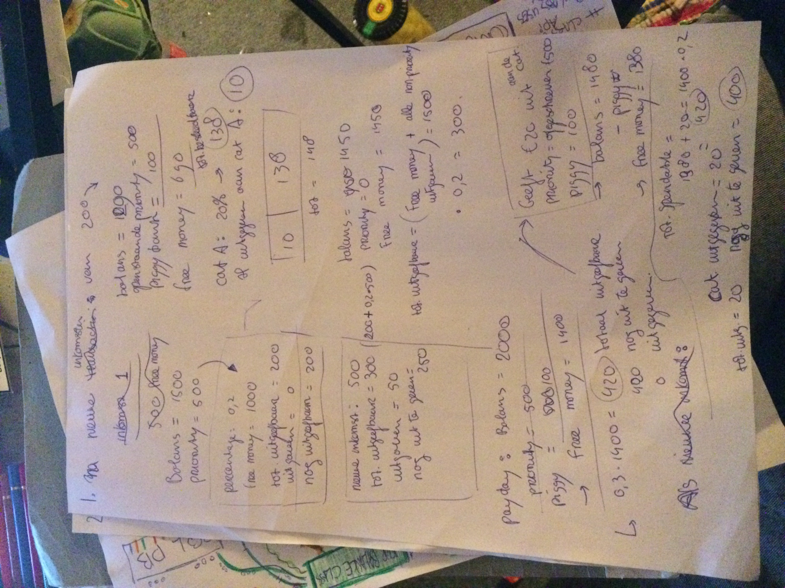

Process Book Eindproject Minor programmeren - 2018

Jurrian Schreuder - 11053542

# day 1
- Project proposal geschreven
- Keuze gemaakt voor geanimeerd side-menu
	--> []https://github.com/Yalantis/Side-Menu.Android

# day 2
- Begonnen met onderzoek doen voor design
- Onderzoek gedaan naar hoe fragments werken; opzet blijkt anders dan bij activity's
- Begonnen met schrijven van Design

# day 3
- Onderzoek gedaan voor design
- Visualisatie van verschillende schermen in de app gemaakt met photoshop
- Design document afgemaakt

# day 4 do

- Onderzoek gedaan naar hoe fragments werken:
	- Youtube tutorials gekeken
	- Artikelen gelezen
	- Hulp gevraagd aan TA's en andere studenten
		
# day 5

- Door gedoe met Git nieuwe repository aan moeten maken
- Naar een youtube tutorial de basics van de UI neergezet in code
- Uitgezocht waarom code het niet doet;
	Uiteindelijk keuze gemaakt om code uit tutorial met placeholders over
	te nemen en stapsgewijs aan te passen. 

# day 6

- Omdat het menu nog niet werkte de eigen fragments tijdelijk vervangen met placeholders uit
de tutorial
- Icons uitgezocht voor menu

# day 7

- Menu center screen gemaakt vanwege esthetische overwegingen
- Placeholder fragments vervangen door eigen fragments
- Thema-kleuren voor de app bedacht: gekozen voor paars/wit thema;
	keuze voor paars komt vanuit feit dat het een financiele app is,
	hetgeen in mijn optiek luxe moet uitstralen. 
	Paars heeft een connotatie van luxe. 
- Lang bezig geweest met fragments correct krijgen

# day 8

- App deed het plots niet meer; ondanks hulp TA's niet direct uitgevonden waardoor dit kwam.
	- Hier vrijwel de hele dag mee bezig geweest
	- Uiteindelijk besloten een oudere versie van Git te halen die wel werkte
	- Kopie gemaakt van niet werkende code
	- Besloten om stapsgewijst uit te zoeken wat het probleem was
		--> Lag waarschijnlijk aan de build.gradle
	- Door deze rare bug niets nieuws kunnen schrijven

# day 9 t/m 11

Niet aan app kunnen werken; vrijstelling voor deze dagen gekregen van Martijn

# day 12

- Rare bug er eindelijk uitgekregen, delen van code in werkende app stapsgewijs vervangen
door elementen uit niet werkende deel --> App doet het weer!
- Keuze gemaakt om gebruik te maken van ING-api ipv Open bank project
	--> documentation hierbij is veel beter te volgen
- Onderzoek gedaan naar ING-api; documentation gelezen etc
- Na uitvinden dat er elke dag naar git gepusht moet worden mijn process book,
	notities uit kladblok in PROCESS.MD gezet

# day 13

- Uiteindelijk fragments addCategory en addIncome werkend gekregen
- Terugklikken bij alle fragments gefixt
- Backend (o.a. classes) en laatste deel front end voor een groot deel uitgewerkt; nog niet geschreven
- Ingelezen over ing api

  
  
  

# day 14

- Besloten van main een soort user-overzicht te maken
- Begin van uiteindelijke layout voor main/User gemaakt
- Besloten piggybank te maken
- Besloten history weg te laten en te vervangen met priority in side-menu
	--> priority vrijwel zelfde layout en backend als income
- Besloten geen firebase maar SQL database te gebruiken
- In principe definitieve plan voor app gemaakt:
	- Alle fragments die nodig zijn
	- Alle classes die nodig zijn
		- Alle variabelen binnen class
		- Alle functies binnen class
	- Welke fragments welke classes nodig hebben
	- Welke classes andere classes nodig hebben
	- Welke classes de API nodig hebben
	- Welke classes de sqlDatabase nodig hebben

	--> Zie doc/eindprojectClasses.pdf overzicht hiervan

# day 15

- Overbodige code (contentfragment) weggehaald
- Menu aangepast; iconen + history weggehaald
- Skelet van backend van de code geschreven
- Definitieve frontEnd voor fragments ontworpen
- Definitieve frontEnd vrijwel alle fragents zo goed als afgemaakt
- Onderzoek gedaan naar ing api en hoe de sandbox precies werkt

# day 16
- Gehele dag onderzoek gedaan naar ing api en geprobeerd deze werkend te krijgen

# day 17/18
- Na veel moeilijkheden besloten om de ing api niet te gebruiken
- Besloten om gebruiker zelf transacties in te laten voeren, dmv van een foto-naar tekst api van
    google: Google Vision, onderdeel van de firebase ML-kit
     --> []https://firebase.google.com/docs/ml-kit/recognize-text

- Besloten om PiggyBank weg te laten uit de app

# day 19
- Google vision werkend gekregen
- Nieuwe fragments gemaakt

day 20
- Hele dag bezig geweest met bug waardoor app crashde bij onBackClick()
    + na maken foto waren alle buttons plotseling niet meer clickbaar
   --> nog geen oplossing gevonden

day 21
- Bezig geweest met zelfde bug als gisteren
- Sql-DB + benodigdheden geschreven voor addTransactions
- Bug grotendeels opgelost, maar o.a. bug onstaan waardoor het zetten van de editText na gebruik camera niet meer werkt

day 22
- Laatste bugs uit de app gehaald: onBackClicked() werkt nu overal
- Transactions-Listview layout gemaakt
- Invoer data vanuit input-menu naar transactions-Listview gefixt
- Kleine aanpassingen aan layout gemaakt
- Code opgeschoond
- Comments toegevoegd

