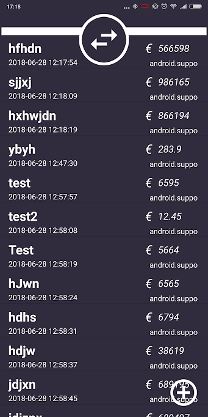
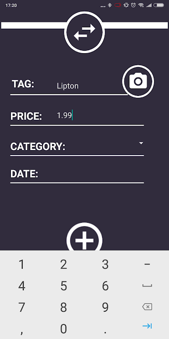
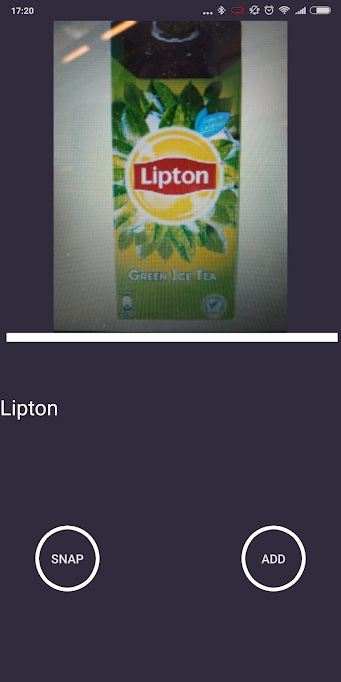

# Eindproject apps Minor Programmeren Universiteit van Amsterdam - 2018

Budgetteer-app

Jurrian Schreuder (11053542)

## Problem statement
	
### Problem Statement
	Veel studenten hebben moeite met het overzichtelijk houden van hun financiën en hun uitgaven te structureren, 
	waardoor er vaak nog maand over is aan het einde van hun geld. 

### Target audience
	Studenten; mensen tussen de 18 en 28 jaar oud die een studie of opleiding volgen aan de universiteit of 
	hogeschool en moeite hebben met het structureren van hun uitgaven. 

## Solution
	
### Single sentence summary
	Een app die je uitgaven structureert a.d.h.v. ingevoerde transacties, waarbij je namen van transacties kan toevoegen met behulp van een image-to-text API (Google Vision).

### Screenshots: 

## Main features
	
### Minumum Viable Product
	- Laat de gebruiker uitgaven toevoegen aan een SQL-database
	- Laat de gebruiker tag's aan zijn uitgaven toevoegen d.m.v. de camera, via een image-to-text API
	- Laat een overzicht zien van de uitgaven van de gebruiker

### TODO
	- Laat de gebruiker een overzicht van zijn uitgaven, inkomsten etc. zien wanneer de app opstart.
	-	Laat de gebruiker zelf categorieen maken waarin zij hun uitgaven kunnen indelen.
	-	Laat de gebruiker prioriteits-uitgaven (bijv. de huur) definiëren, welke automatisch gealloceerd worden als niet-		 
		besteedbaar geld in hun balans.
	-	Laat de gebruiker per categorie welk percentage van hun (non-priority) geld zij kunnen besteden in de vorm van een 

## Prerequisites

### Data sources: 

	De Google Vision API (Onderdeel van de Firebase Machine-Learning kit) is gebruikt om invoer van tag's bij transacties toe te voegen middels de camera.
		https://firebase.google.com/docs/ml-kit/recognize-text

### External components: 

	De Side-Menu.Android van Yalantis is gebruikt voor het sidemenu dat navigatie door de app mogelijk maakt.
		https://github.com/Yalantis/Side-Menu.Android
	