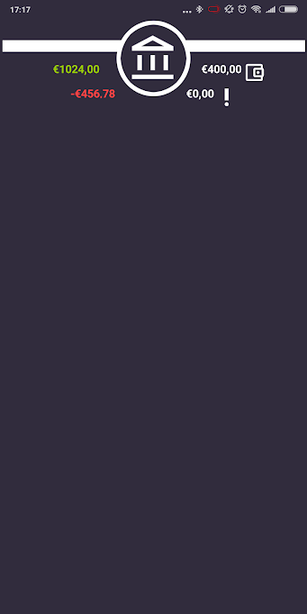
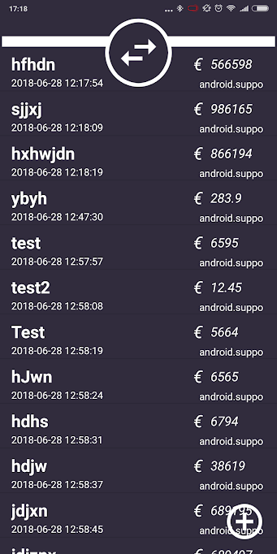
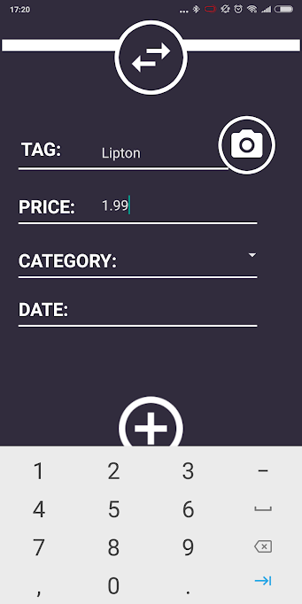

# FINAL REPORT

## App description

Veel studenten hebben moeite met het overzichtelijk houden van hun financiën en hun uitgaven te structureren, 
waardoor er vaak nog maand over is aan het einde van hun geld. De Budgetteer-app, gemaakt voor het eindproject
van de Minor Programmeren, biedt een oplossing voor dit probleem. De app biedt gebruikers de mogelijkheid om 
transacties die zij doen toe te voegen aan de app en hier een tag aan toe te voegen middels hun camera, 
door bijvoorbeeld een foto te nemen van het logo van de Albert Heijn na het doen van boodschappen.

Hoewel nog niet volledig geïmplementeerd, kan bij het toevoegen van een nieuwe 
uitgave ook een categorie geselecteerd worden. Deze categorieën kan de gebruiker zelf invoeren en hierbij bepalen 
hoeveel procent van zijn/haar 'vrij besteedbare' geld aan deze categorie uitgegeven kan worden deze maand. 
In het balans-scherm kan de gebruiker vervolgens zien hoeveel geld hij/zij per categorie heeft uitgegeven en nog te besteden heeft.

'Vrij besteedbaar geld' wordt bepaald door de door de gebruiker ingevoerde prioriteitsuitgaven af te trekken van de 
(ook door de gebruiker ingevoerde) inkomsten. Prioriteitsuitgaven zijn uitgaven die iedere maand worden afgeschreven, 
zoals bijvoorbeeld de huur of collegegeld. Deze moeten automatisch bijgewerkt worden. Voor inkomsten geldt hetzelfde. 

## Technical design

### High level overview
De app maakt gebruik van fragments, hetgeen het mogelijk maakt om het geanimeerde side-menu te implementeren. 
Wanneer de gebruiker de app opstart, komt hij terecht op de 'UserFragment': een pagina met een overzicht van de totale inkomsten,
totale uitgaven, afgeschreven prioritietsuitgaven, vrij besteedbare geld en de resterende dagen tot de volgende inkomsten.
Door vanaf de linker-rand van het scherm te swipen, wordt het side-menu geopend. 

Vanuit hier kan de gebruiker door naar (van boven naar beneden:) de UserFragment, de BalanceFragment, IncomeFragment, PriorityFragment en de
TransactionsFragment. Hoewel nog niet geimplementeerd, moet er in de BalanceFragment een overzicht van alle categorieën van de gebruiker te zien zijn.
Aan de bovenkant van het scherm, naast het Balance-icoon, is de huidige balans, de totale uitgaven van die maand, het vrij besteedbare geld en de 
prioriteitsuitgaven te zien. Per categorie wordt (naast de naam van de categorie) het besteedbare geld (per categorie) weergegeven, hoeveel procent van 
het vrij besteedbare geld dit is, hoeveel geld de gebruiker deze maand al aan deze categorie heeft uitgegeven en hoeveel de gebruiker nog 
te besteden heeft binnen deze categorie. Om categorieën toe te voegen, kan de gebruiker klikken op een (nog te implementeren) onderaan het scherm, 
die hem doorverwijst naar een vergelijkbaar scherm als de AddTransactionFragment. Hierover later meer. 

Zowel de IncomeFragment als de PriorityFragment moeten een lijst laten zien met hierin de vaste inkomsten of lasten per maand. Deze worden automatisch 
bij-/afgeschreven op de door de gebruiker toegevoegde datum. Bijvoorbeeld, wanneer een gebruiker de inkomste 'STUFI' heeft toegevoegd en hierbij vermeldt 
heeft dat deze op de 24e wordt bijgeschreven, dan wordt op de 24e automatisch dit bedrag op de balans erbij geschreven.

Net als bij de BalanceFragment zal het toevoegen van inkomsten of prioriteitsuitgaven gedaan worden via een button onderin het scherm, die de gebruiker 
doorverwijst naar een invoer-menu vergelijkbaar met de AddTransactionFragment. In dit menu kan de gebruiker (voor zowel prioriteitsuitgaven als inkomsten)
een naam toevoegen, het bedrag dat binnenkomt/wordt afgeschreven en de datum waarop deze transactie iedere maand plaatsvindt. 

Helemaal onderaan in het menu, onder inkomsten en prioriteitsuitgaven, kan de gebruiker klikken om naar Transacties te gaan. Hier wordt een lijst weergeven 
van de, door de gebruiker toegevoegde, gedane uitgaven. Hierbij is een Tag, het uitgegeven bedrag, de datum van invoer en de categorie waaronder de transactie
valt te zien. Onderin het scherm is een knop te zien, via waar de gebruiker op bij een invoer-menu komt. 

In dit invoer menu kan de gebruiker de eerder genoemde variabelen (Tag, Price, category en date) invoeren. De Tag kan op twee manieren ingevoerd worden:
door deze in te typen, of door een foto van het product/locate/etc. te maken. Vanaf deze foto kan de app tekst herkennen, welke wordt toegevoegd
als tag. Wanneer de gebruiker op de camera-knop klikt, wordt deze automatisch doorgestuurd naar de camera. Na het maken van een foto komt de gebruiker 
vervolgens op de AddTransactionCameraFragment terecht, waar hij de keuze krijgt om de zojuist gemaakte foto (en de daarbij behorende tekst) toe te voegen als tag,
of om een nieuwe foto te maken. Als de gebruiker tevreden is met de ingevoerde informatie, klikt deze op de grote ronde knop aan de onderkant van het scherm, waarna
de transactie wordt toegevoegd aan de lijst. 

### Detailed overview

#### MainActivity & UserFragment
Hoewel de app gebruik maakt van fragments, heeft de app één Activity om deze fragments mogelijk te maken: de MainActivity. 
Binnen deze activity staat de code die het geanimeerde side-menu mogelijk maakt. Hier worden (middels 'createMenuList()') de
verschillende items in het side-menu gedefiniëerd en toegevoegd aan de item-list van het menu. De functie 'setActionBar()' 
kan gezien worden als de motor van het side-menu; deze functie regelt het openen en het sluiten van het menu. 

Wanneer er op een keuze-optie binnen het menu wordt geklikt, wordt de 'onSwitch()' methode gebruikt om te bepalen welke 
fragment geopend moet worden. Binnen de onSwitch() wordt vervolgens de relevante 'replace-X-Fragment()' functie aangeroepen,
welke de desbetreffende fragment opent. 

In tegenstelling tot (de meeste) andere fragments, wordt UserFragment niet aangeroepen met een 'normale' replaceFragment-functie, 
maar wordt er in de onCreate() van de MainActivity een Userfragment.newInstance() aangemaakt. Deze wordt hier aangemaakt zodat 
er savedState's bijgehouden kunnen worden. Aangezien de overige fragments die binnen het side-menu vallen in de onSwitch() via 
deze Userfragment lopen (e.g. UserFragment.BALANCE), is het niet nodig om verdere onSaveInstanceState's etc. aan te maken voor deze
fragments. 

#### TransactionsFragment
Vanuit het side-menu kom je, wanneer je op de onderste knop klikt, op de TransactionsFragment uit. Evenals bij de UserFragment, wordt 
hiervoor een '.newInstance()' gebruikt i.p.v. een 'normale' replaceFragment-functie. Dit is gedaan omdat er vanuit de TransactionsFragment
genavigeerd kan worden naar de AddTransactionFragment (en vanuit daar naar de AddTransactionCameraFragment), welke, aangezien deze niet 
aangeroepen worden via de MainActivity/UserFragment, anders geen informatie zouden kunnen behouden na het wisselen van Fragments. 
In de TransactionsFragment is een listview te zien met daarin de verschillende transacties van de gebruiker. Om in deze lijst de transacties
te weergeven, worden in de 'onCreateView()' de ListviewAdapter en de database welke de adapter gebruikt aangeroepen. Hierover later meer. 

Om data toe te voegen aan deze lijst, kan er geklikt worden op een knop rechtsonderaan het scherm. Deze knop stuurt de gebruiker door naar
de AddTransactionFragment, waar nieuwe data ingevoerd kan worden. Hier wordt wederom een .newInstance() gebruikt, aangezien er data tijdens
de sessie bewaard moet blijven. 

#### AddTransactionFragment & TransactionEntry.java
In de AddTransactionFragment kan de gebruiker een nieuwe transactie toevoegen. De door de gebruiker ingevoerde data (Tag, Price, Category)
wordt bij het klikken op de grote ronde knop onderaan het scherm tot een TransactionEntry-object gemaakt. 
Deze data wordt d.m.v. addTransactionEntry() van de editTexts verzameld, tot TransactionEntry-object gemaakt en 
toegevoegd aan de database, waar er automatisch een datum en tijd aan gekoppeld wordt. Het TransactionEntry-object wordt aangemaakt
d.m.v. een constructor, welke te vinden is in TransactionEntry.java. Tot slot wordt de gebruiker terugverwezen naar de TransactionsFragment,
waar de listView geupdate wordt met de zojuist ingevoerde transactie. 

Naast handmatig invoeren van de Tag kan de gebruiker er ook voor kiezen om een foto te gebruiken welke de app gebruikt om een tag te maken.
Om dit te doen, klikt de gebruiker op de camera-knop naast de Tag-editText. Vanuit hier wordt de gebruiker doorverwezen naar de 
AddTransactionCameraFragment. Ook hier wordt een nieuwe instance voor aangemaakt. 

#### Database.java & EntryAdapter.java
Zoals hierboven al vermeld wordt, wordt er in de TransactionsFragment gebruik gemaakt van een SQL-database en een adapter. 
De database zelf en de functies die voor de database gebruikt worden zijn te vinden in Database.java: een Database-constructor,
een insert()- functie om data toe te voegen aan de SQL-database, een getter (getDatabase) om de data uit de database op te vragen
vanuit andere fragments en een selectAll() functie, welke een cursor aanmaakt voor de EntryAdapter. 

De EntryAdapter-class, welke wordt gebruikt in de TransactionsFragment, bestaat uit de EntryAdapter-constructor en de bindView() functie, 
welke de waarden uit de database koppelt aan de individuele textViews binnen iedere rij. 

#### AddTransactionCameraFragment
Bij het klikken op de camera-knop in de AddTransactionFragment, wordt de gebruiker doorverwezen naar de AddTransactionCameraFragment. 
Wanneer dit fragment wordt geopend, wordt automatisch de camera geopend. De keuze hiervoor is gemaakt om het doorlopen van de app 
zo soepel mogelijk te laten verlopen voor de gebruiker. Dit gebeurt dankzij de 'dispatchTakePictureIntent()' functie die wordt aangeroepen 
in de 'onCreateView()'. Deze functie wordt ook aangeroepen wanneer de gebruiker op de 'SNAP' knopt klikt. Deze knop bestaat om de gebruiker, wanneer er bijvoorbeeld 
geen tekst wordt herkent in een foto, een nieuwe foto te laten maken. 

Wanneer de gebruiker een foto heeft genomen, wordt er in de 'onActiviyResult()' (Welke automatisch wordt aangeroepen na het maken van een foto) de foto
uit de gegenereerde Bundle gehaald en geplaatst op de imageView van de AddTransactionCameraObject. Vervolgens wordt de 'detectTxt()' functie aangeroepen,
waarbinnen de Google Vision/Firebase Vision API zijn werk doet om de tekst uit de afbeelding te halen. De gegenereerde tekst wordt vervolgens doorgegeven 
aan de 'processTxt()', waar de gedetecteerde text vanuit een Block wordt omgezet naar een String, om vervolgens in de (lege) textView van 
de AddTransactioCameraFragment geplaatst te worden. Wanneer er geen tekst is gevonden, krijgt de gebruiker een Toast message: "No Text :(".

Naast de 'SNAP'-knop, staat de 'ADD'-knop. Bij het klikken hierop wordt er een bundle aangemaakt waarin de eerder gevonden tekst in wordt gestopt
en wordt meegegeven aan de AddTransactionFragment. Vervolgens wordt de gebruiker teruggebracht naar de AddTransactionFragment, waar zoals eerder beschreven
de tekst uit de bundle wordt gehaald en wordt toegevoegd aan de listView. 

## Challenges during development

Terugkijkend op de afgelopen vier weken kan er gesteld worden dat het ontwikkelen van deze app niet zonder moeite is verlopen, te zien aan het feit dat
het niet gelukt is om een afgerond product af te leveren. Ook is het niet gelukt om de ING-/Open Bank Project-API te implementeren. Dit wil echter 
zeker niet zeggen dat ik ontevreden ben over het verloop van deze opdracht; juist door de struikelblokken die ik ben tegengekomen heb ik veel lessen geleerd
over het opzetten en uitvoeren van een programmeerproject. Al met al zijn er tijdens dit project twee 'fouten' gemaakt die ervoor gezorgd hebben dat ik 
niet tot het beoogde eindproduct ben gekomen. 

De eerste paar dagen van het project verliepen verliepen goed: al vrij had ik snel een plan opgesteld voor mijn app en had online een library gevonden 
voor een geanimeerd side-menu, wat de navigatie door de app gebruikersvriendelijk zou maken en er ook nog eens goed uit zag. Ik moest alleen nog even
uitvogelen hoe fragments precies werken, dit was namelijk nodig voor het navigatiemenu. Achteraf gezien ben ik hier de eerste 'fout' begaan van dit project.
Het gebruiken van Fragments zorgt er namelijk voor dat dingen die normaal relatief makkelijk zijn, zoals bijvoorbeeld de transitie van de ene pagina naar de andere,
behoorlijk moeilijk te maken. Hierdoor ben ik de afgelopen weken voornamelijk bezig geweest met het debuggen van fragment-gerelateerde problemen, waardoor ik
niet aan alle onderdelen van de back-end (en een deel van de front-end) ben toegekomen. Dit heeft er ook toe geleid dat het maken van een HistoryFragment 
geschrapt is, zowel als de later bedachte PiggyBank. Daarnaast is er ook nog de keuze gemaakt om het automatiseren van de transacties middels de ING-/
Open Bank Project-API te schrappen. Deze keuze heeft echter niet alleen met de problematiek rondom fragments te maken; de aanvankelijke keuze voor een van 
deze API's was wellicht verkeerd. In het begin van het project had ik mij beter moeten inlezen in o.a. het opzetten van een Sandbox, zodat ik er niet te laat
achter zou zijn gekomen dat het implementeren van deze API's in de gestelde tijd voor het project behoorlijk lastig zou worden. In andere woorden, dit was 
'fout' nummer twee. Na het gebruik van geautomatiseerde transacties te schrappen, besloot ik het handmatige invoeren van de transacties op te leuken met een API.
Ik kwam uit op de Google Vision API, waarmee tekst uit foto's omgezet kan worden in Strings. Het implementeren hiervan verliep relatief makkelijk maar leidde helaas
weer tot fragment-gerelateerde problematiek. 

Uiteindelijk ben ik, ondanks de vele strubbelingen die het veroorzaakte, tevreden met mijn keuze om fragments te gebruiken. De voordelen die het oplevert met
betrekking tot UI-design, zoals bijvoorbeeld het navigatiemenu, maken het de problemen die ik ermee gehad heb waard. Uiteindelijk heb ik relatief goed doorgekregen
hoe fragments precies werken, al gebeurde dit helaas pas de laatste twee dagen van het project. 
