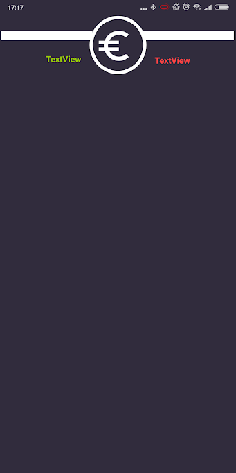
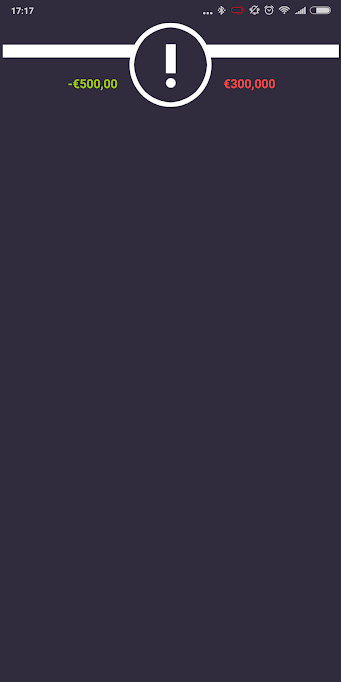
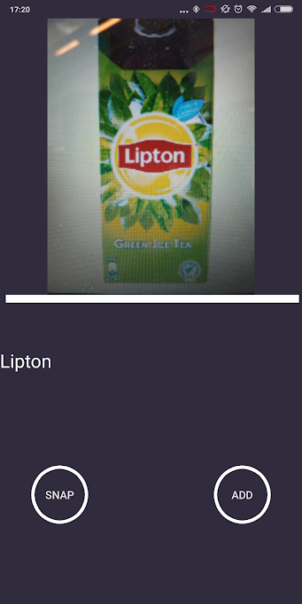

# FINAL REPORT

## App description

Veel studenten hebben moeite met het overzichtelijk houden van hun financiën en hun uitgaven te structureren, 
waardoor er vaak nog maand over is aan het einde van hun geld. De Budgetteer-app, gemaakt voor het eindproject
van de Minor Programmeren, biedt een oplossing voor dit probleem. De app biedt gebruikers de mogelijkheid om transacties die zij doen toe te voegen aan de app en hier een tag
aan toe te voegen middels hun camera, door bijvoorbeeld een foto te nemen van het logo van de Albert Heijn 
na het doen van boodschappen.

Hoewel nog niet volledig geïmplementeerd, kan bij het toevoegen van een nieuwe 
uitgave ook een categorie geselecteerd worden. Deze categorieën kan de gebruiker zelf invoeren en hierbij bepalen 
hoeveel procent van zijn/haar 'vrij besteedbare' geld aan deze categorie uitgegeven kan worden deze maand. 
In het balans-scherm kan de gebruiker vervolgens zien hoeveel geld hij per categorie heeft uitgegeven en nog te besteden heeft.

'Vrij besteedbaar geld' wordt bepaald door de door de gebruiker ingevoerde prioriteitsuitgaven af te trekken van de 
(ook door de gebruiker ingevoerde) inkomsten. Prioriteitsuitgaven zijn uitgaven die iedere maand worden afgeschreven, 
zoals bijvoorbeeld de huur of collegegeld. Deze moeten automatisch bijgewerkt worden. Voor inkomsten geldt hetzelfde. 

## Technical design

### High level overview
De app maakt gebruik van fragments, hetgeen het mogelijk maakt om het geanimeerde side-menu te implementeren. 
Wanneer de gebruiker de app opstart, komt hij terecht op de 'UserFragment': een pagina met een overzicht van de totale inkomsten,
totale uitgaven, afgeschreven prioritietsuitgaven, vrij besteedbare geld en de resterende dagen tot de volgende inkomsten.
Door vanaf de linker-rand van het scherm te swipen, wordt het side-menu geopend. 

Vanuit hier kan de gebruiker door naar (van boven naar beneden:) de UserFragment, de BalanceFragment, IncomeFragment, PriorityFragment en de
TransactionsFragment. Hoewel nog niet geimplementeerd, moet er in de BalanceFragment een overzicht van alle categorieën van de gebruiker te zien zijn.
Aan de bovenkant van het scherm, naast het Balance-icoon, is de huidige balans, de totale uitgaven van die maand, het vrij besteedbare geld en de 
prioriteitsuitgaven te zien. Per categorie wordt (naast de naam van de categorie) het besteedbare geld (per categorie) weergegeven, hoeveel procent van 
het vrij besteedbare geld dit is, hoeveel geld de gebruiker deze maand al aan deze categorie heeft uitgegeven en hoeveel de gebruiker nog 
te besteden heeft binnen deze categorie. Om categorieën toe te voegen, kan de gebruiker klikken op een (nog te implementeren) onderaan het scherm, 
die hem doorverwijst naar een vergelijkbaar scherm als de AddTransactionFragment. Hierover later meer. 

Zowel de IncomeFragment als de PriorityFragment moeten een lijst laten zien met hierin de vaste inkomsten of lasten per maand. Deze worden automatisch 
bij-/afgeschreven op de door de gebruiker toegevoegde datum. Bijvoorbeeld, wanneer een gebruiker de inkomste 'STUFI' heeft toegevoegd en hierbij vermeldt 
heeft dat deze op de 24e wordt bijgeschreven, dan wordt op de 24e automatisch dit bedrag op de balans erbij geschreven.

Net als bij de BalanceFragment zal het toevoegen van inkomsten of prioriteitsuitgaven gedaan worden via een button onderin het scherm, die de gebruiker 
doorverwijst naar een invoer-menu vergelijkbaar met de AddTransactionFragment. In dit menu kan de gebruiker (voor zowel prioriteitsuitgaven als inkomsten)
een naam toevoegen, het bedrag dat binnenkomt/wordt afgeschreven en de datum waarop deze transactie iedere maand plaatsvindt. 

Helemaal onderaan in het menu, onder inkomsten en prioriteitsuitgaven, kan de gebruiker klikken om naar Transacties te gaan. Hier wordt een lijst weergeven 
van de, door de gebruiker toegevoegde, gedane uitgaven. Hierbij is een Tag, het uitgegeven bedrag, de datum van invoer en de categorie waaronder de transactie
valt te zien. Onderin het scherm is een knop te zien, via waar de gebruiker op bij een invoer-menu komt. 

In dit invoer menu kan de gebruiker de eerder genoemde variabelen (Tag, Price, category en date) invoeren. De Tag kan op twee manieren ingevoerd worden:
door deze in te typen, of door een foto van het product/locate/etc. te maken. Vanaf deze foto kan de app tekst herkennen, welke wordt toegevoegd
als tag. Wanneer de gebruiker op de camera-knop klikt, wordt deze automatisch doorgestuurd naar de camera. Na het maken van een foto komt de gebruiker 
vervolgens op de AddTransactionCameraFragment terecht, waar hij de keuze krijgt om de zojuist gemaakte foto (en de daarbij behorende tekst) toe te voegen als tag,
of om een nieuwe foto te maken. Als de gebruiker tevreden is met de ingevoerde informatie, klikt deze op de grote ronde knop aan de onderkant van het scherm, waarna
de transactie wordt toegevoegd aan de lijst. 

### Detailed overview

## Challenges during development

### Why did I make changes in my app-design?
### Trade-offs with current solution
### What would I have done differently?

## Future development

____________

TODO:

- overzicht van app schetsen: wat zijn de activities/fragments/classes en wat doen ze

- nieuwe readme maken + oude readme veranderen in proposal.md

- eindverslag schrijven
	- Solution: usefullness + coherence van je app
	- Interaction design: pleasant/consistent designm ease of use, prevention of errors
	- Process: evaluation of rigor as evidenced in process book, cleanlyness of 
		repository and commit history (every day)
	- Final report: 
		- to what extent have you clearly documented your project, 
			the design and the understanding of chosen topic
	- Code: Well-designed + readable

		Opbouw: 
		- SHort description of application
		- Describe technical design: how is functionality implemented
			--> like design.md but updated
			First: high level overview
			second: go into detail; describe modules/classes (apps)
							files/functions (data)
							and how they relate
		- describe challenges during development
			document all important changes 
			--> let see how much youve learned past month
		- defend decisions by writing argument (single paragraph)
			why was is good to do it different?
			trade-offs current solution?
			given more time: would you choose another solution?
	
		MAKE SURE: 
		document is complete and reflects the final state of the appliction

na 6: 

- filmpje maken